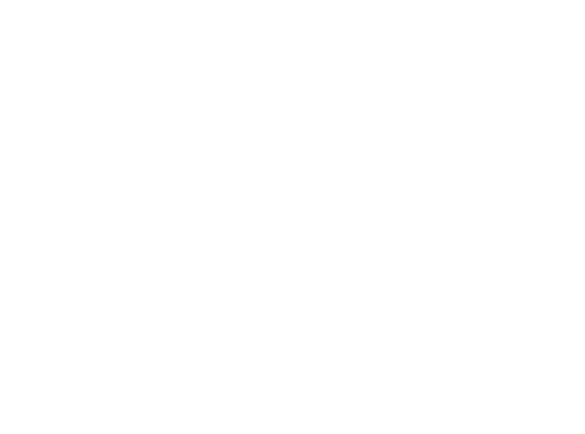

# 🎨 NFTICKIT Branding

Our brand toolkit. All documents here are how we use to express the NFTICKIT brand.

## Guidelines
It’s **NFTICKIT**. Do not abbreviate or use spaces in the name.
It's simple, like our app. NFT and Tick-it.
**NFTICKIT**

Spell `Tickit` with `IT` from `Information Technology`.
NF. Tick. It.
**NFTICKIT**

Our name isn't NFTICKET. Or NFT Ticket.

**DO**
- NFTICKIT
- NFTick.it
- NFTickit

**DON'T**
- ~~NFT Tickit~~
- ~~NFT T Tickit~~
- ~~NFT Ticket~~
- ~~NFTicks~~
- ~~NFTTTickit~~
- ~~NFTicket~~
- ~~nftickit~~
- ~~NfTiCkIt~~
- ~~nfticket~~
- ~~NfTiCkEt~~

## Colors
 Darkest Purple: `#464099`

 Base Purple: `#665EE0`

 Ink Darkest: `#141414`

 Ink Darker: `#1F1F1F`

 Ink Dark: `#282828`

 Ink Base: `#414042`

 Ink Light: `#57585B`

 Ink Lighter: `#929497`

 Sky Base: `#F6F6F6`

 White: `#FFFFFF`

## Logo

### Colorful
      

### All Black
  

### All White
  

## Brand

### Plugue The Pug

### Plugue: The Icon

